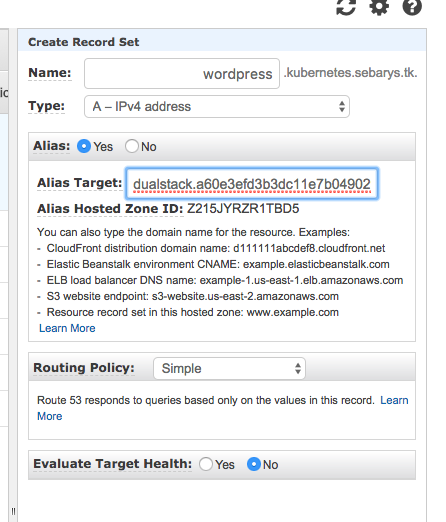

# Wordpress with volumes

First we are creating new storage class from manifest in *deployments/wordpress-volumes/storage.yml*

Next we need volume claim for database e.g. 10GB which is described in *deployments/wordpress-volumes/pv-claim.yml*

This claim will be used by our mysql database Pod creating by ReplicationController from manifest in *deployments/wordpress-volumes/wordpress-db.yml*

Pod will be exposed by service defined in file *deployments/wordpress-volumes/wordpress-db-service.yml*

All secrets are defined by manifest in file *deployments/wordpress-volumes/wordpress-secrets.yml*


Definition of wordpress application which will be connect to created mysql database is in file *deployments/wordpress-volumes/wordpress-web.yml*
In all replica of our app we want to have access to the same assets so we can mount nfs volume that will store wordpress resources (in examaple using AWS efs).

```
To create efs manually (our user need to have permission AmazonElasticFileSystemFullAccess):
$ aws efs create-file-system --creation-token 1(UNIQUE_NUMBER)
{
    "SizeInBytes": {
        "Value": 0
    },
    "CreationToken": "1",
    "CreationTime": 1508315005.0,
    "PerformanceMode": "generalPurpose",
    "FileSystemId": "FILE_SYSTEM_ID",
    "NumberOfMountTargets": 0,
    "LifeCycleState": "creating",
    "OwnerId": "OWNER_ID"
}

$ aws ec2 describe-instances
//get subnetId and securityGroupId

$ aws efs create-mount-target --file-system-id FILE_SYSTEM_ID --subnet-id SUBNET_ID --security-groups SECURITY_GROUP_ID
{
    "MountTargetId": "MOUNT_TARGET_ID",
    "NetworkInterfaceId": "NETWORK_INTERGACE_ID",
    "FileSystemId": "FILE_SYSTEM_ID",
    "LifeCycleState": "creating",
    "SubnetId": "SUBNET_ID",
    "OwnerId": "ONWER_ID",
    "IpAddress": "IP_ADDRESS"
}

```

Wordpress page will expose service using AWS LoadBalancer from manifest in file  *deployments/wordpress-volumes/wordpress-web-service.yml*

Now we can create whole project:
```
kubectl create -f storage.yml
kubectl create -f pv-claim.yml
kubectl create -f wordpress-secrets.yml
kubectl create -f wordpress-db.yml
kubectl create -f wordpress-db-service.yml
kubectl create -f wordpress-web.yml
kubectl create -f wordpress-web-service.yml
```

We are using LoadBalancer and if we want to use proper DNS name we need to go to Route53 -> our DNS management and create new record set as alias to created LoadBalancer.
<p align="left"></p>

Wordpress blog will be visible under created route.
