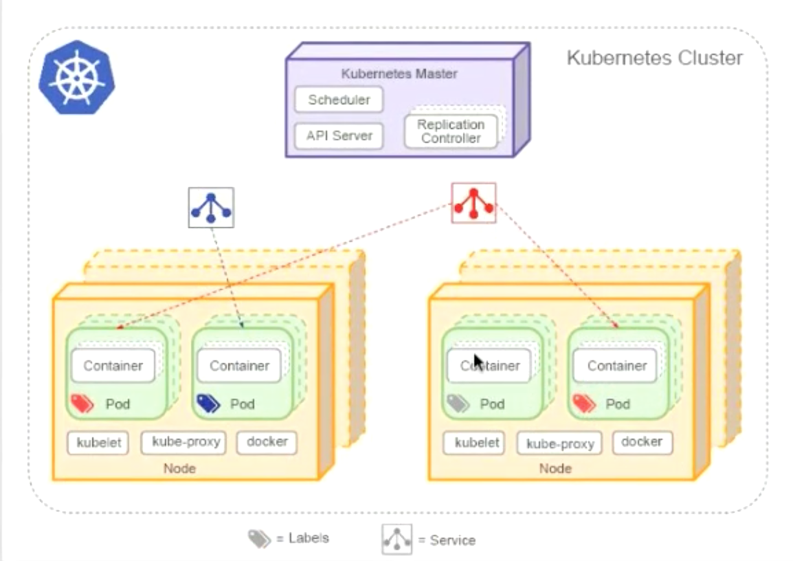

# Master services

Kubectl is communicate with master node by REST interface.
Each request will be send in etcd (cluster distributed data store).

Scheduler is scheduling pods if they are not scheduled yet.

Controller manager is built from many controllers.

Kubelet is a interface used to communicate with master on slave nodes.
