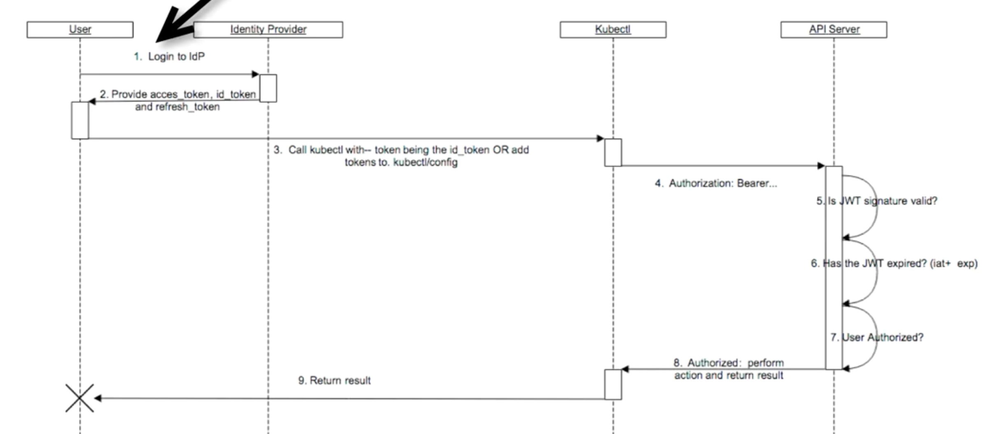

# Authentication

Currently X509 certificates are used by default to authenticate users
to the kubernetes api-server. Certificate is issued during first setup cluster (minikube, kops is doing this for us).

## Possible alternatives:
### http basic authentication
it can be done by static file with credentials in master node, and pass this file as an argument to apiserver: `--basic-auth-file=/path/to/file`

File need to be in format
```
username, password, uid, "groupWithPermission1, groupWithPermission2"
```

Downsides:
- not so secure
- if you want to add user you need to restart apiserver

### Using own proxy

Requirements:
- client certificate passed to api server used `--requestheader-client-ca-file` flag (you don't want anyone will be acting as a proxy so you need provide proxy certificate)
- proxy need to pass login header set in apiserver by `--requestheader-username-headers=X-Remote-User`, apiserver will use value of this header to know who is performing actions in the cluster
- `--requestheader-group-headers=X-Remote-Group` can be used to set the group

Downsides:
- really generic, need some time to implement

### OpenID Connect tokens

Is build on top of OAuth2.
You authenticate yourself -> receive an ID Token
Token can be verified because it is signed. This token is JWT (Json Web Token).
You can pass this token to kubectl commands by flag `kubectl ... --token=<TOKEN>`

<p align="left"></p>


## OpenID Demo:
- identity provider: https://auth0.com/pricing (7000 users for free)
- create new client with e.g. `Allowed callback URLs` set to http://authserver.kubernetes.sebarys.tk/callback and `Allowed logout URLs` set to  http://authserver.kubernetes.sebarys.tk/ (our k8s cluster authentication endpoint)
- when we creating kops cluster we need to edit configuration to allow OpenID authentication in spec we need to add:
```
spec:
  kubeAPIServer:
    oidcIssuerURL: <OUR_CLIENT_DOMAIN_IN_AUTH0>
    oidcClientID: <CLIENT_ID>
    oidcUsernameClaim: sub

```
