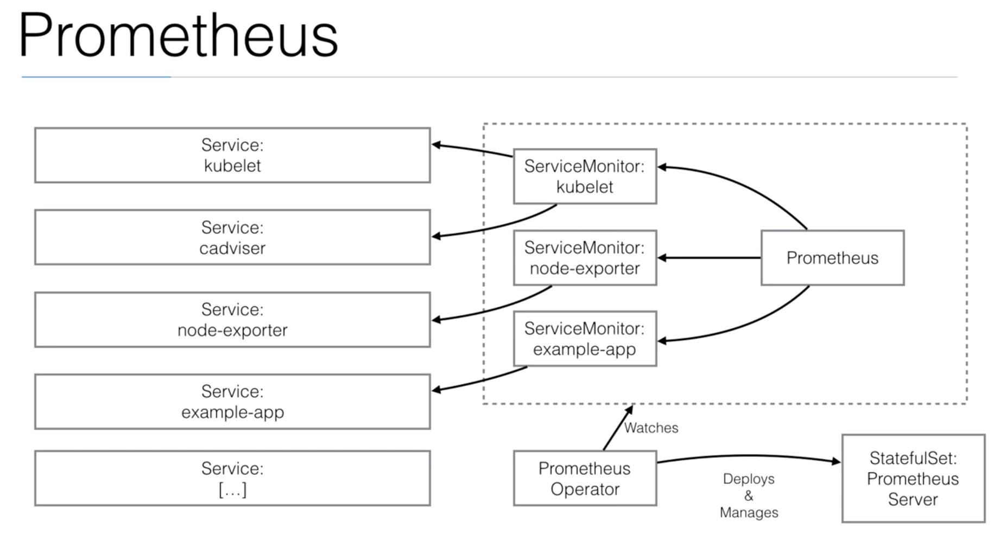

# Prometheus

Open source (build in Soundcloud) monitoring and alerting tool, can be compared to the Heapster + Grafana setup from the earlier chapters but can do a lot more.

Metrics collection happens via a pull model over HTTP.

We will create Prometheus Operator component that allow us to register resources that we want to monitor.

First we create role-based access control (rbac.yml)  
`kubectl create -f deployments/prometheus/rbac.yml`

Then we are deploying prometheus operator  
`kubectl create -f deployments/prometheus/prometheus.yml`

Next we are creating prometheus-resource that is a definition of resource used by our Prometheus server StatefulSet.  
`kubectl create -f deployments/prometheus/prometheus-resource.yml`

Next we are creating kubernetes monitoring that will ensure that k8s provide all necessary resources (services, deployments ...)  
`kubectl create -f deployments/prometheus/kubernetes-monitoring.yml`

We have one example app which have declaration of ServiceMonitor, all declaration that have flag prometheus-enabled set to "true" will be automatically included in metrics.  
kubectl create -f deployments/prometheus/example-app.yml`

Now we can check if our new resource is available by executing command:  
`kubectl get prometheus`

To connect to prometheus endpoint we can get service url and access it by browser.
In web console we can check what targets we are monitoring (Status -> Targets). With targets we have described labels which we can use in expressions. Expressions can be created in Graph tab, e.g. to list http_request_total for example-app (service="example-app")
following expression will be valid: **http_requests_total{service="example-app"}**

To sum up: if we want to gather metrics from our app, we need to tag it with flag **prometheus-enabled: "true"** and create ServiceMonitor with the same label (like in example-app, we tagged Service of example-app and created ServiceMonitor).
